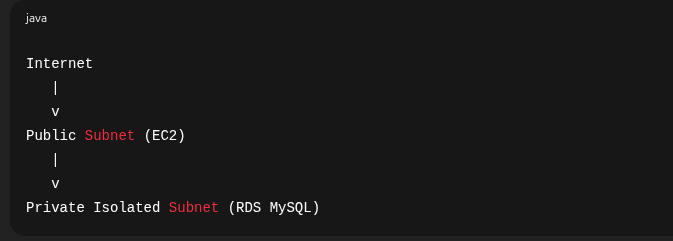
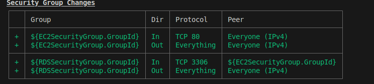
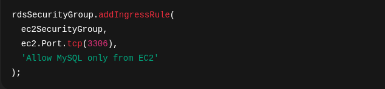
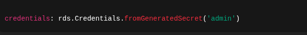
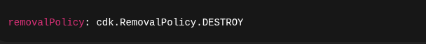

# 🏥 TechHealth Migration : How I Secured a Healthcare App on AWS Using CDK.

Security-First Healthcare Infrastructure on AWS using CDK (TypeScript)

Note: This is a proof of concept / prototype case study built for learning and portfolio purposes.
The architecture and decisions reflect real-world healthcare security and compliance considerations.

## Scenario considered:

Five years ago, TechHealth launched its patient portal on AWS using manual, console-based infrastructure. While this worked initially, over time it led to:

- Slow, error-prone deployments

- Environment inconsistencies

- Hard-to-audit security configurations

- No reliable rollback strategy

To support growth and meet healthcare security expectations, the infrastructure needed to be automated, version-controlled, and secure by design.

## 📌 Project Overview

TechHealth Migration is a self-directed Infrastructure as Code (IaC) project that demonstrates how to design, secure, and deploy a healthcare web application on AWS using the AWS Cloud Development Kit (CDK) and TypeScript.

The project focuses on:

* Network segmentation

* Least-privilege security

* Secure database access

* Infrastructure consistency and traceability

All infrastructure is defined as code, version-controlled, and reproducible.

## 🏗️ Architecture Summary

This project deploys a three-tier AWS architecture:

* VPC (Network Layer)

  Multi-AZ VPC with public and private isolated subnets

* EC2 (Application Layer)

  Public-facing application server with controlled access

* RDS MySQL (Data Layer)

  Private, isolated database with no internet exposure

## High-Level Design

✔️ Database is unreachable from the internet

✔️ Only EC2 can communicate with RDS

✔️ Admin access handled via AWS Systems Manager (no SSH)

## 🔐 Security-First Design

Security was treated as a core requirement, not an afterthought.

### Network Segmentation

* Public subnets host application resources

* Private isolated subnets host the database

* No NAT Gateways → reduced attack surface and lower cost

### Security Groups (Least Privilege)

- EC2: allows HTTP traffic from the internet
- Allows administrative access  SSM

- RDS: allows MySQL traffic only from EC2

### Identity & Access Management

* EC2 uses an IAM role with AmazonSSMManagedInstanceCore

* No SSH keys, no exposed port 22

* Secure instance access via AWS Systems Manager

### Credential Management

* Database credentials generated automatically

* Stored securely in AWS Secrets Manager

* No hardcoded passwords in code or config files

## 🧩 Key AWS Services Used

* AWS CDK (TypeScript)

* Amazon VPC

* Amazon EC2

* Amazon RDS (MySQL 8.0)

* AWS IAM

* AWS Systems Manager

* AWS Secrets Manager

## 📄 Infrastructure Code Highlights

### Security Group Isolation Between EC2 and RDS

### Secure Database Credentials

## 💰 Cost Considerations

* No NAT Gateways (significant cost savings)

* t3.micro EC2 and RDS instances

* Development-friendly cleanup with:

⚠️ In production environments, the database removal policy should be set to RETAIN.

## 🚀 Deployment Instructions
### Prerequisites

* AWS CLI configured

* Node.js (v18+ recommended)

* AWS CDK installed

   *npm install -g aws-cdk*

### Deploy the Stack
- npm install
- cdk bootstrap
- cdk deploy

### Tear Down Resources
 *cdk destroy*

## 📈 What This Project Demonstrates

- Real-world AWS architecture patterns

- Infrastructure as Code best practices

- Security group design and network isolation

- Secure credential handling

- Cost-aware cloud design

- Clear documentation and traceability

## 🔮 Future Enhancements

- Application Load Balancer (ALB)

- Auto Scaling Group for EC2

- HTTPS with ACM certificates

- CI/CD pipeline using GitHub Actions

- RDS Multi-AZ for production-grade HA

